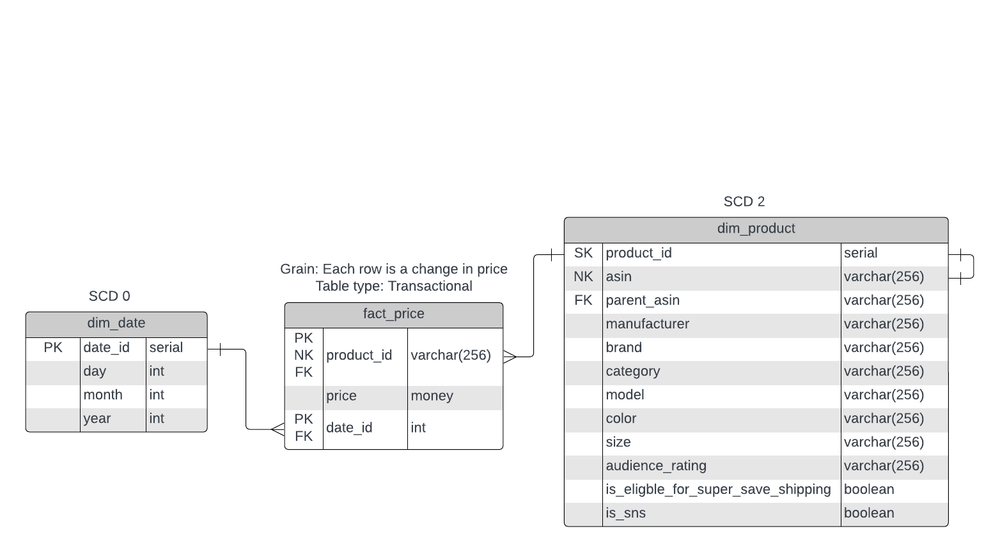

# Database Overview
## RDBMS
The RDBMS used is PostgreSQL version 15. The driver for this decision was its
open source nature but any RDBMS will work. If you choose to use another
RDBMS or another version of PostgreSQL, you may need to modify the `init_db.sql`
script to be compliant with that SQL dialect.

## Database Design
The database is designed using a Kimball star schema. Star schemas are popular
for analytical workloads due to their ability to store historic information
and their smaller number of tables are more performant for joins and grabbing
large amounts of data.

## Database ERD

